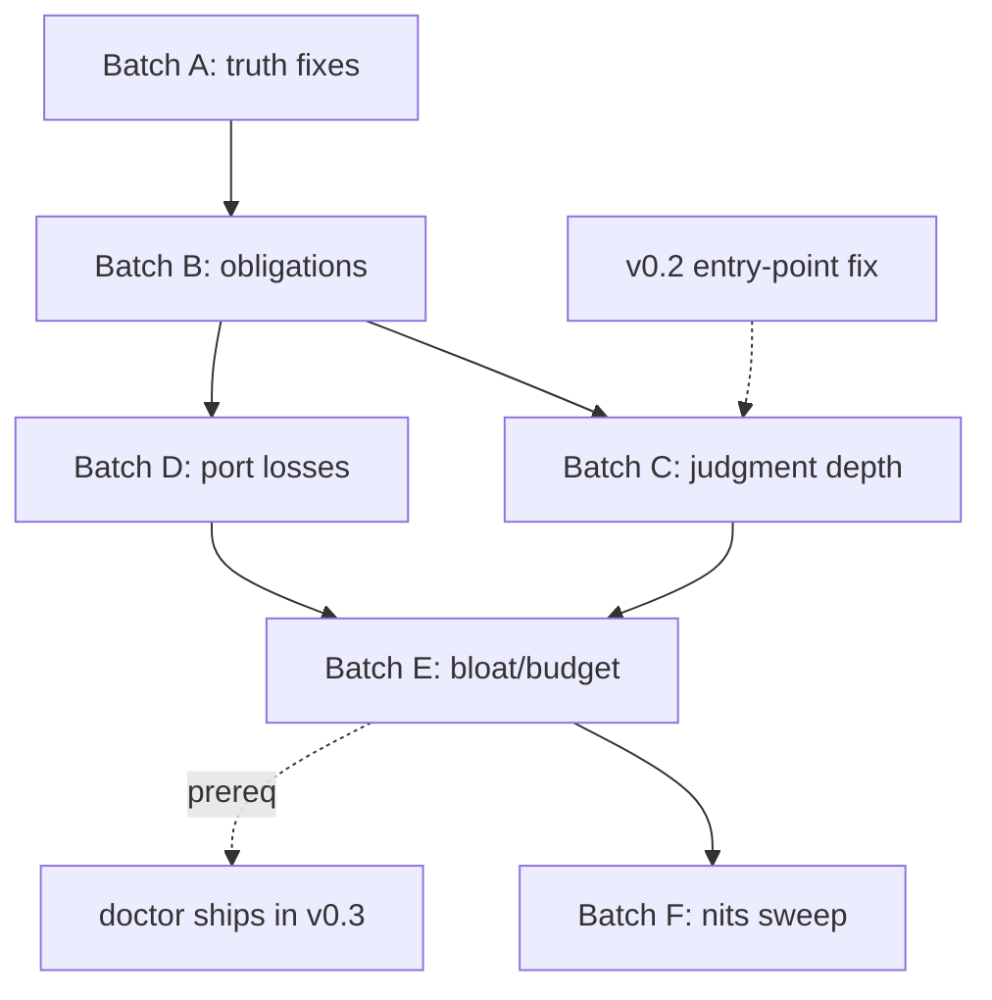

# ossify Skill Audit — Findings + Enhancement Plan

**Date:** 2026-08-09
**Scope:** every shipped `SKILL.md`, `references/*.md`, `commands/*.md`, and `agents/*.md` in `ossify/`
**Purpose:** a quality-and-depth audit of the ported skill content (not a prose-vs-code truth audit) plus an enhancement plan
**Companion to:** `2026-08-05-plan-c1-branch-review.md` (the C1 correctness review)
**Relationship to the capability-gap absorption spec:** the 7 new capability references (`2026-08-09-ossify-capability-gap-absorption.md`) are new content, not enhancements to existing content. They are out of scope for this audit.

---

## Method

Five quality axes were evaluated for every file:

1. **Quality and depth** — Is the content genuinely useful guidance, or thin filler? Does it teach judgment with enough specificity to be actionable?
2. **Over-bloat** — Duplicated content, ceremony inflation, redundant depth vs. the owning SKILL.md.
3. **Under-coverage** — Judgment calls the agent will face that are left unguided.
4. **Staleness from the port** — Old vocabulary (slice/sprint/VS-N.M.K), old concepts (multi-year roadmap, 10-phase onboarding), or machinery that works differently now.
5. **Consistency** — Voice, structure, cross-references, routing accuracy.

**Deduplication:** the C1 branch review (`2026-08-05`) filed 24 confirmed findings (1 critical, 7 major, 14 minor, 2 nit) against the correctness layer (prose-vs-lib truth, rc contracts, test coverage, shell correctness). Those findings are **not re-reported here**. Where an enhancement proposed here would subsume a C1 finding, the C1 finding is cross-referenced by its severity tag.

**Source of truth:** the ossify specs govern. Where a skill deviates from the spec, the skill is wrong, not the spec.

---

## Phase 1 — Skill Surface Inventory

### Entry skills and references

| Skill | SKILL.md (lines) | References (count) | References (lines) | Total (~tokens) |
|---|---|---|---|---|
| `start` | 499 | 11 | 1,483 | ~5,835 |
| `plan-release` | 461 | 8 | 1,328 | ~5,896 |
| `plan-spine` | 499 | 8 | 1,362 | ~6,677 |
| `work-item` | 388 | 6 | 1,067 | ~5,270 |
| `close` | 361 | 9 | 1,980 | ~8,080 |
| `doctor` | not shipped (planned v0.3) | — | — | — |
| **Total** | **2,208** | **42** | **7,220** | **~31,758** |

### Commands and agents

| File | Lines | ~Tokens |
|---|---|---|
| `commands/start.md` | 22 | ~139 |
| `commands/plan-release.md` | 24 | ~163 |
| `commands/plan-spine.md` | 25 | ~192 |
| `commands/work-item.md` | 28 | ~231 |
| `commands/close.md` | 27 | ~214 |
| `agents/implementer-agent.md` | 77 | ~1,065 |

Full token map: ~99,265 tokens across all skills, commands, agents, and references (per `wc -w` × 1.33).

### Every-call listing cost (the progressive-disclosure budget)

The 5 entry skills expose only their frontmatter `description` on every call:

| Skill | Description (words) | ~Tokens |
|---|---|---|
| `start` | 101 | ~163 |
| `plan-release` | 94 | ~147 |
| `plan-spine` | 91 | ~149 |
| `work-item` | 109 | ~175 |
| `close` | 99 | ~149 |
| **Total** | **494** | **~783** |

Target: ~0.3-0.4% of a 200k context window = 600-800 tokens. The 5 shipped descriptions total ~783 tokens, sitting at the upper edge of the target band (~0.39%). The planned 6th entry skill (`doctor`) will push past the band unless existing descriptions are trimmed. See finding X-1.

The absorption spec's preamble claims descriptions are "~2-3 lines"; the actual descriptions run 91-109 words (4-6 lines). This is a real budget pressure.

---

## Phase 2 — Executive Summary

### Overall assessment

The skill set is in **genuinely good shape**. The majority of references rate *deep* — failure-mode-first guidance, worked examples, spec-anchored contracts, honest deferral naming. The port from scaffold-dev/scaffold-onboard rethought rather than renamed: demo-authoring, spine-close, and handoff-contract are model ports that inverted the old stack's documented failure modes. Voice and structure are remarkably uniform across all 43 references.

Findings concentrate in four themes:

1. **One internal contract contradiction** (critical) — the gaps-mode timing contract contradicts itself across 6 surfaces.
2. **Orphaned obligations** — artifacts or obligations the docs read but nothing authors (EXECUTIVE-SUMMARY, SPINE.md, bone ADR files, the rounds record, the community-edition ledger line, "the close summary").
3. **Silent port losses** — mechanics and worked examples dropped without the repo's own named-deferral convention (the AC grammar, the lean-index check, the malformed-return menu row, the Codex dispatch mechanics).
4. **Judgment arms that teach the negative space better than the positive** — impl-check Layer 3, quarantine innocence, fake-expiry triggers, patch-lane branch placement.

### Per-file ratings

| File | Rating | One-line summary |
|---|---|---|
| **start** | | |
| `journey-map.md` | deep | Patton story map: line grammar, marking, harvest |
| `skeleton-cut.md` | adequate | Deriving the thinnest coherent path; marking collision |
| `bones-registry.md` | adequate | 9-category checklist; touch surfaces; orphaned ADR mechanics |
| `risk-gates.md` | deep | Harm-scaled control menu; downstream mechanics |
| `smoke-test-pass.md` | deep | Per-claim verification protocol; smoke-vs-spike boundary |
| `spike-contract.md` | adequate | Six-field disposable contract; no persistence home |
| `posture-block.md` | deep | Posture + moat channels + boundary artifacts; strongest doc |
| `critic-moment.md` | deep | One-shot spec-core critic invocation; silent-failure catalog |
| `lean-spec-schema.md` | adequate | 7-section schema; EXEC-SUMMARY orphaned |
| `onboarding-question-subset.md` | deep | Question split + contested cuts; exemplary judgment teaching |
| `memory-bank-brief.md` | adequate | Re-anchored derivation; category 3/5 homeless |
| **plan-release** | | |
| `feature-map-grooming.md` | adequate | Four-pass groom; rank/prune unexecutable |
| `spine-sequencing-dag.md` | deep | Inter-spine DAG; false-edge taxonomy |
| `class-declaration.md` | deep | Bone/flesh/enabler ladder; headless gap |
| `bone-touch-judge.md` | deep | Mechanical touch_check; rc contract |
| `critic-veto.md` | deep | Fail-closed interpretation ladder; no non-class disposition |
| `real-use-findings.md` | deep | Mandatory asked-input; elicitation |
| `release-md-emission.md` | adequate | 5-section contract; unresolved placeholder |
| `rolling-wave.md` | deep | Three horizons; one-release-ahead cap |
| **plan-spine** | | |
| `decomposition.md` | adequate | 1-5 bound doctrine; >5 escape hatch missing |
| `dag-rounds.md` | adequate | Edge tests; no worked interrogation |
| `spec-authoring.md` | thin | Per-round doctrine; AC grammar omitted |
| `citation-foldin.md` | adequate | Mechanical check; dual-root gap |
| `demo-authoring.md` | deep | F1-F6 floor contract; journey-line judgment; headless gap |
| `demo-amendments.md` | deep | Supersede/retire semantics; quarantine's non-planning status |
| `fake-ledger-discipline.md` | deep | Banned-fakes + trigger/expiry; worked cases |
| `cross-repo.md` | adequate | target_repo dimension; community-edition line orphaned |
| **work-item** | | |
| `handoff-contract.md` | deep | 12-section authoring contract; drift-deadlock analysis |
| `pre-flight.md` | deep | Four hard gates; gap archetypes; gaps-mode contradiction |
| `tdd-loop.md` | adequate | Worked RED-GREEN; case 3 misframed |
| `report-contract.md` | deep | Pinned 10-section set; machine consumers |
| `returns.md` | deep | Two return shapes; gaps-mode's three non-uses |
| `round-orchestration.md` | adequate | Orchestrator lane; 3 port-dropped coverage gaps |
| **close** | | |
| `routing.md` | deep | Id-shape router; refusal semantics |
| `work-item-close.md` | deep | Path resolution; merge block; commit-message gap |
| `spine-close.md` | deep | 11-step ceremony; merge-guard exegesis |
| `release-close.md` | deep | Outer layer; blocking gates; goal-source missing |
| `cumulative-demo.md` | adequate | Operated ledger; quarantine needs positive procedure |
| `fake-expiry.md` | deep | Mechanical + judgment arms; external-trigger gap |
| `harvest.md` | adequate | State-driven enumeration; lean-index drop; undefined noun |
| `impl-check.md` | adequate | 3-layer gate; Layer 3 too thin |
| `retrospective.md` | deep | Pinned section contract; class-scoped redesign |
| `patch-lane.md` | adequate | Routing judgment; target branch unspecified |

---

## Phase 2 — Findings by Skill

Severity tags: **critical** · **important** · **minor** · **nit**

### Cross-cutting findings

---

#### X-1 — [important][bloat] Every-call listing at the budget ceiling; descriptions far exceed "~2-3 lines"

**Files:** all 5 `SKILL.md` frontmatter descriptions

The progressive-disclosure design targets ~0.3-0.4% of a 200k context window (600-800 tokens) for the entry skills' frontmatter. The 5 shipped descriptions total ~783 tokens (~0.39%), sitting at the upper edge. The absorption spec's preamble (`2026-08-09-ossify-capability-gap-absorption.md:23`) claims descriptions are "~2-3 lines"; the actual descriptions run 91-109 words each (4-6 lines of dense prose). The planned 6th entry skill (`doctor`) will push the total to ~930+ tokens (~0.47%), breaching the budget.

**Enhancement:** Before `doctor` ships (v0.3), audit each description for compressible content. The target is ~60-80 words per description (~120 tokens), leaving headroom for the 6th. Several descriptions carry routing detail ("Do NOT use for...") that could be compressed from multi-clause lists to single sentences.

---

#### X-2 — [important][bloat] implementer-agent.md description embeds the full contract (~1,065 tokens)

**File:** `ossify/agents/implementer-agent.md`

The subagent registration's `description` field is a ~1,065-token restatement of the entire work-item contract (pre-flight gates, RED-gate rc table, TDD loop, verification, report, stage, return, and the full NEVER list). This description is surfaced in every agent-listing context. The registration body itself says this restatement exists because "a caller dispatching you through the `Task` tool may see only this file's `description`" — but the file also instructs the agent to "Read `${CLAUDE_PLUGIN_ROOT}/skills/work-item/SKILL.md` in full as your first action," which is the actual contract. The 1,065-token description is unaccounted in the progressive-disclosure budget.

**Enhancement:** Compress the description to the routing essentials (what it does, what it returns, the NEVER highlights) and rely on the body's instruction to read the skill. The full contract restatement can stay in the body; it does not need to be in the listing-cost description.

---

#### X-3 — [minor][staleness] work-item SKILL.md composes superpowers skills

**File:** `ossify/skills/work-item/SKILL.md:377-378`

```
**Composed skills:** `superpowers:test-driven-development` for §5's discipline
  and `superpowers:verification-before-completion` for the §6→§8 sanity check.
```

The `superpowers` plugin is the exact library the 2026-08-09 consolidation review (`2026-08-09-ossify-capability-gap-absorption.md`) identifies as being replaced by the four-plugin target set (ossify + ai-mentor + architect-critic + claude-security-audit). The absorption spec explicitly maps `test-driven-development` and `verification-before-completion` as "already covered" by ossify's own contracts (TDD in the implementer gate, verification in the work-item §6 discipline). Composing skills from a plugin the consolidation removes creates a stale dependency.

**Enhancement:** Either drop the composition (the skill body already teaches TDD discipline in §5 and verification in §6), or re-anchor to the ossify-native equivalents once the consolidation lands. If kept as-is for v0.1, mark it as transitional.

---

### start

---

#### START-1 — [important][consistency] Skeleton-marking ownership collides between journey-map.md and skeleton-cut.md

**Files:** `start/references/journey-map.md` §3/§5, `start/references/skeleton-cut.md` §2, `start/SKILL.md` §5/§6

`journey-map.md` §3: "every step gets a mark before you leave this block" and §5: "Every step NOT marked `skeleton` is recorded as a candidate spine before you leave this block." The harvest at §5 requires marks to exist.

`skeleton-cut.md` §2 steps 2-3: "Mark exactly those steps `skeleton`. Everything else is `next` or `later`" — claiming the same act one station later.

Concrete failure path: an agent that defers skeleton-marking to §6 (as skeleton-cut.md instructs) cannot run the §5 harvest correctly. Either nothing is marked `skeleton` yet (so the harvest sweeps future-skeleton steps into the feature map, violating "Do not `feature_add` skeleton steps"), or the harvest is deferred past its stated trigger.

SKILL.md §5/§6 has the same ambiguity and should move with the fix.

**Enhancement:** One doc should own the marking. Cleanest resolution: journey-map.md marks `next`/`later` candidates during §5 and harvests after; skeleton-cut.md §2 becomes validation + the promise sentence. Or: journey-map.md marks everything, skeleton-cut.md only re-marks the `skeleton` steps.

---

#### START-2 — [important][coverage] Bone ADR file mechanics are orphaned

**File:** `start/references/bones-registry.md`

§3 says "ADR reference — `ADR-NNNN`, minted in the project's ADR sequence" and "the ADR file carries the full context / decision / consequences prose," but no doc says *where* the ADR directory is, *how* the number is minted, or what filename/format to use. `oss bone_add` only writes the registry index row. Ossify ships no `/adr` utility and no `oss adr_*` verb (confirmed: `bin/oss` has no adr subcommand, `commands/` has five files, none adr). The legacy source (`scaffold-dev/skills/recording-architecture-decision`) had explicit mechanics — next-number scan, kebab-case filename, MADR-lite template, routing. The port rethought the registry and orphaned the file mechanics.

An agent executing SKILL.md §7 for the first time must invent the ADR-authoring step.

**Enhancement:** Add a short "authoring the ADR file" subsection to bones-registry.md (interim convention: directory, numbering, MADR-lite sections) or an explicit "until `/adr` ships in v0.3, author it thus" note.

---

#### START-3 — [important][coverage] EXECUTIVE-SUMMARY has no authoring step

**Files:** `start/references/lean-spec-schema.md` §1, `start/SKILL.md` §13

§1 names EXECUTIVE-SUMMARY as one of "two derived artifacts." SKILL.md §13 lists it as an output routed "per manifest routing." But no SKILL.md step and no reference says when or how it gets written. `memory-bank-brief.md` covers the bank + CLAUDE.md only. In the legacy stack, `onboarding-project` §8 owned EXEC-SUMMARY synthesis; the port dropped the ownership with the mechanism.

**Enhancement:** Add an authoring line (owner: `start`, at outputs time, derived from lean MASTER-SPEC §1-§3, a page or less) either in SKILL.md §13 or in lean-spec-schema.md.

---

#### START-4 — [important][coverage] Memory-bank mapping has no destination for bones categories 3 and 5

**File:** `start/references/memory-bank-brief.md` §1

The §1 mapping routes categories 1, 2, 4, 6, 7 to `02-system-patterns`; 8 to `03`/`04`; 9 + risk gates to `07-constraints`. Category 3 (**data ownership & migration posture**) and category 5 (**trust boundaries & destructive operations**) appear in no row. The legacy pipeline had a home for this content (domain model to `01-product-context` from phase 3; security posture to `02-system-patterns` from phase 4). Under this mapping, the hardest-to-reverse bone's content lands nowhere in the bank.

**Enhancement:** Extend the mapping: e.g. `01-product-context` from journey map + category 3 (entities/ownership); `07-constraints` from risk gates + categories 5 + 9.

---

#### START-5 — [important][coverage] Spec §7's optional mechanical fitness `auto:` lines absent from bone anatomy

**Files:** `start/references/bones-registry.md` §3, spec §7

Spec §7: "optionally 1-2 mechanical fitness `auto:` lines (dependency direction, schema compatibility — mechanical facts only)… that join the cumulative demo ledger." These are absent from the bone anatomy (§3 lists exactly four parts: ADR ref, title, touch surface, revisit trigger) and unrepresentable in the `oss bone_add` signature.

A spec'd capability silently dies if the authoring doc never names it.

**Enhancement:** Add fitness lines as an optional fifth part (even if interim mechanics are "list them in the ADR body; `plan-spine` picks them up"), or record a deliberate-omission note.

---

#### START-6 — [important][coverage] Spike contract + decision note have no durable home

**File:** `start/references/spike-contract.md` §4

§4 step 1: "Write the contract (§2). Show it to the user; get an explicit go." Step 5: "Write the decision note." Step 6: "Fold the decision into the bone's ADR." Written *where*? No `oss spike_*` verb exists, and spec §9.2's state schema names no spike entity. For a contract whose entire purpose is enforceability ("disposable **by contract**"), the six fields exist only in conversation until the outcome is folded into an ADR — and if the spike is declined or interrupted, nothing persists at all.

**Enhancement:** Name a home (e.g. a `### Spike contract` section in the affected bone's ADR, or the spec's spike paragraph) for both the contract and the decision note.

---

#### START-7 — [minor][bloat] SKILL.md §10 duplicates the posture P-rules and C-table nearly verbatim with posture-block.md

**Files:** `start/SKILL.md` §10, `start/references/posture-block.md` §2/§4

The fail-dangerous contract (public-to-private impossible) justifies the redundancy, but the two renderings have already drifted in wording. SKILL.md C3: "No narrower seam isolates the moat / nothing enumerated" vs. posture-block.md: "…or nothing has been enumerated because the posture came from the P1 fail-safe."

**Enhancement:** If kept in both places, byte-align them, or compress SKILL.md's copy to a pointer.

---

#### START-8 — [minor][staleness] memory-bank-brief.md drops the mcrules preserve-zone and AGENTS.md/settings.json emissions

**File:** `start/references/memory-bank-brief.md`

§3's `03` seed instruction drops the legacy `mcrules:preserve` sentinel zone that protects user-authored rules across re-derive (the legacy #63 bug class). The legacy skill also emitted `AGENTS.md` and `.claude/settings.json`; this brief is silent about both.

**Enhancement:** One sentence either way — either restore the preserve-zone, or say the harvest never rewrites `03` so the zone is unnecessary; note that AGENTS.md/settings.json are deliberately not carried.

---

#### START-9 — [minor][coverage] critic-moment.md has no branch for v0.3+

**File:** `start/references/critic-moment.md` §2/§3

§2/§3 branch on exactly two probe outputs (`v0.2`, `absent`), but `oss critic_detect` can print `v0.3` (spine-close.md:255 already documents both).

**Enhancement:** "v0.2 or later" would fix the prose side and subsume the C1-filed test-side finding.

---

#### START-10 — [minor][consistency] critic-moment.md has an orphaned step 6 after §3.1

**File:** `start/references/critic-moment.md`

§3 is numbered 1-5, then §3.1 intervenes, then an orphaned "6. Continue to the Release-0-minimums recap…" dangles after §3.1.

**Enhancement:** Move §3.1 after the numbered sequence or fold step 6 into step 5.

---

#### START-11 — [minor][staleness] lean-spec-schema.md §5 describes a validator routed from `doctor` (unshipped)

**File:** `start/references/lean-spec-schema.md` §5

§5 re-enumerates validation rules in prose, which the legacy stack deliberately refused to do ("Re-enumerating creates drift risk"). Acceptable while no lib validator exists, but should be marked as interim.

**Enhancement:** Add "until the validator ships (v0.3), this prose is the rule set."

---

#### START-12 — [minor][coverage] onboarding-question-subset.md does not account for legacy Phase 2 (Strategy)

**File:** `start/references/onboarding-question-subset.md` §1/§2

Legacy Phase 2 questions ("Target weeks-to-MVP?" etc.) are unaccounted. Per the doc's own rule ("If a question has no trigger, it does not come back, and that is the correct outcome") this is probably a deliberate cut, but should be said.

**Enhancement:** One row in §2 noting the cut and its reason.

---

#### START-13 — [nit][bloat] skeleton-cut.md §6 is a tautology

**File:** `start/references/skeleton-cut.md` §6

"The cut is never 'minimal' — it *is* the minimum" restates journey-map.md §6 without adding a floor.

**Enhancement:** Fold into §2 or cut.

---

#### START-14 — [nit][consistency] critic-moment.md heading "What NOT to do" deviates from the convention

**File:** `start/references/critic-moment.md` §6

Every sibling uses "Anti-patterns."

**Enhancement:** Rename to "Anti-patterns."

---

### plan-release

---

#### REL-1 — [important][coverage] class-declaration.md rung 1 unguided for headless products

**File:** `plan-release/references/class-declaration.md` §1

Spec §3: "a headless product (library, DB, service) defines its journey at its real surface — e.g. a downstream API round trip — and no UI is invented." Rung 1 as written says "A named actor performs an action and reaches an observable outcome they came for," and all four worked-contrast rows use human actors. An agent planning a library/DB project could read rung 1 as requiring a human and mis-trip `internal-enabler` on every legitimate spine. The doc's own anti-example ("the endpoint returns 200") reads as banning the API surface that *is* the journey for a service product.

**Enhancement:** One sentence plus one table row: "downstream service completes a round trip through the real API" passes rung 1; the ban is on artifact-existence, not on non-human actors.

---

#### REL-2 — [important][consistency] release-md-emission.md uses an unresolved `<ai-workspace>` placeholder

**File:** `plan-release/references/release-md-emission.md` §1/§3

The only filesystem command is `mkdir -p "<ai-workspace>/docs/specs/$rel"` with an unresolved placeholder. The sibling `close` skill resolves this concretely: `ai_root="$(oss repo_root ai_workspace)"` appears in close/SKILL.md §3, release-close.md, work-item-close.md, and harvest.md. `lib/id.sh` has an `oss_id_release_dir` helper that is not wrapped by the dispatcher (no `oss_cmd_release_dir`). plan-spine/references/spec-authoring.md has the same placeholder pattern.

**Enhancement:** Show the `oss repo_root ai_workspace` call (matching close's convention) and consider exposing `oss release_dir`.

---

#### REL-3 — [important][coverage] feature-map-grooming.md rank/prune passes are unexecutable

**File:** `plan-release/references/feature-map-grooming.md` §2 pass 2, §2 pass 4

The doc calls the map a "living ranked list" four times, and pass 4 says superseded entries "are removed with a one-line reason" — but only `feature_add` (name/value/class_guess/source) and `feature_list` exist (confirmed: `lib/commands.sh` lines 40-41, 88). No rank field, no reorder, no remove. An agent executing pass 2 or pass 4 must either hand-edit state or silently no-op the pass.

**Enhancement:** State where ranking lives (array order, conversation-only, or "grooming's only persisted output is the release's spine selection") and how a prune is executed or recorded.

---

#### REL-4 — [important][coverage] critic-veto.md has no disposition for substantive non-class findings

**File:** `plan-release/references/critic-veto.md` §3 Gate A

Gate A's "not veto-grade" list contains only trivial cases (cosmetic, `alternative`-severity, style, praise). But the critic audits the whole RELEASE.md and can return release-level findings — "the exit criteria contradict each other", "the DAG serializes two independent spines", "the goal is not a user journey". These are neither veto-grade nor class-irrelevant trivia; under the doc as written they fall out of Gate A and produce *nothing* — not even a mention in the digest.

**Enhancement:** One clause: "findings that are substantive but not class-bearing are not veto input; surface them to the user as ordinary critique and fold accepted ones into the plan before final render."

---

#### REL-5 — [minor][bloat] class-declaration.md §5 states the same sentence twice

**File:** `plan-release/references/class-declaration.md` §5

"A non-admitted enabler never gets a spine id at all — it goes back to the feature map (§4)" appears in the intro and again near-verbatim as the closing line.

**Enhancement:** Drop one.

---

#### REL-6 — [minor][coverage] spine-sequencing-dag.md does not state the mandatory enabler-to-consumer edge

**File:** `plan-release/references/spine-sequencing-dag.md` §2

class-declaration.md §4 admits an internal-enabler only with a named committed consumer. When both are in the current release, the DAG must carry the enabler-to-consumer edge or the consumer can legitimately start first. Derivable from test 1, but the admission rule creates this pairing by contract.

**Enhancement:** One explicit line: when an admitted internal-enabler's consumer is in the same release, the DAG carries the edge.

---

#### REL-7 — [minor][coverage] real-use-findings.md never says findings can be filed when they occur

**File:** `plan-release/references/real-use-findings.md` §2

The doc frames the planning-time question as the collection channel but never says findings can be filed mid-release via `oss feature_add ... real-use`. An agent could read the ceremony as the only legitimate entry point.

**Enhancement:** One line: "the §2 questions are the sweep, not the only channel — file findings as they happen."

---

#### REL-8 — [minor][coverage] release-md-emission.md §3 renders veto_dispositions/class_overrides without scoping

**File:** `plan-release/references/release-md-emission.md` §3

Both arrays are global across all releases; a literal read dumps prior releases' records into this release's RELEASE.md.

**Enhancement:** Show a jq filter by this release's spine-id prefix.

---

#### REL-9 — [nit][quality] bone-touch-judge.md §2 lead snippet is the wrong shape

**File:** `plan-release/references/bone-touch-judge.md` §2

§2 leads with a runnable-looking two-branch `if` and only afterwards explains that the shape folds rc 2 into "clean." A skimming agent may copy the first block.

**Enhancement:** Add `# WRONG for class declaration — see below` comment in the toy snippet.

---

#### REL-10 — [nit][consistency] class-declaration.md §4 uses eval-suite jargon

**File:** `plan-release/references/class-declaration.md` §4

"the `journey-line-floor` surface owns the consumer rule" uses eval-suite vocabulary ("surface") a first-time reader has no frame for.

**Enhancement:** Gloss or drop the jargon; the useful pointer is "plan-spine enforces the demo-line floors."

---

### plan-spine

---

#### SP-1 — [important][coverage+consistency] spec-authoring.md omits the AC grammar entirely; two different `auto:` grammars

**File:** `plan-spine/references/spec-authoring.md` §2

The doc never states the AC grammar its own specs must parse under. §2 says only "Machine-checkable `auto:` lines + any `user:` step." The work-item spec gate (`oss verify_acs`, `lib/verify.sh`; `close/references/impl-check.md` §2) parses: `- [ ] AC-<N> auto: \`<command>\` -> expected: exit <n> | output contains <str>` — checkbox, `AC-N` label, backticked command, U+2192 arrow, and a *space-form* expectation.

Meanwhile the ledger takes `exit:<n>` | `contains:<str>` (colon-form). An agent authoring from this doc will naturally model ACs on the ledger examples it just wrote in §8 — `exit:0` instead of `exit 0`, no label, no backticks — and produce specs that yield zero parsed ACs at execution time.

The ported-from `ac-authoring-grammar.md` existed precisely to carry this and was dropped without re-homing it.

**Enhancement:** Restore the grammar (or point at `close/references/impl-check.md` as its owner) and add the explicit contrast: the ledger's `expected` and the spec's `expected:` are different grammars.

---

#### SP-2 — [important][consistency] Per-round spec authoring assigned to a lane that does not carry it

**File:** `plan-spine/references/spec-authoring.md` §3

§3 asserts: "someone must remember to author round *K*'s spec at round *K*'s start. **That is the execution engine's first step for the round.**" It is not. `work-item/references/round-orchestration.md` §3-§4 begin the round with worktree creation and handoff authoring, and §4 describes the handoff landing "beside the `spec.md` **plan-spine wrote**" (past tense). The worker's pre-flight Gate 2 requires the spec to exist and parse. SKILL.md §6 sanctions deferring later rounds' specs, so the docs create the obligation, assign it to a lane that does not carry it, and the lane assumes the artifact already exists.

**Enhancement:** Name the real owner and moment (who authors a deferred spec, and how the round flow knows to pause for it), or drop the deferral.

---

#### SP-3 — [important][consistency] Rounds are never recorded anywhere; SPINE.md has no explicit authoring step

**Files:** `plan-spine/SKILL.md` §5, `plan-spine/references/spec-authoring.md` §1, `work-item/references/round-orchestration.md` §1

SKILL.md §5 derives the round structure and shows its display format but no step writes it to a file. spec-authoring.md §1's tree comment says "SPINE.md # the spine plan: items, rounds, demo contribution, fakes" — implying SPINE.md exists. round-orchestration.md §1 states: "No state field holds the work-item rounds... until it lands the plan document is the only record."

Meanwhile `close/references/spine-close.md` reads `base_branch` from SPINE.md's spine-context section (line 70), and the critic audit exports `--spec` pointing at SPINE.md (spine-close.md:270-273). SPINE.md is a load-bearing artifact the consumer depends on, but no skill step explicitly authors it.

**Enhancement:** Add an explicit "Write SPINE.md" step in SKILL.md §5 or §6: the round structure, the decomposition, and the demo contribution go into it. Cross-ref the consumers.

---

#### SP-4 — [important][bloat] SKILL.md §8 duplicates demo-authoring.md near-verbatim; body at 499/500

**Files:** `plan-spine/SKILL.md` §8a-§8d, `plan-spine/references/demo-authoring.md` §1-§5

SKILL.md §8a restates all six floors; §8b carries the full read-out template *and* the per-floor `n/a` rules *and* the REJECT remedies; §8c carries the full journey-line test and the false-reject essay; §8d carries the complete mechanical-backstop scope plus four of the same five example lines. Roughly 60-70 of the body's 499 lines duplicate reference content. The body is at 499 against its own 500-line hard cap.

This inverts the progressive-disclosure contract: the body is always loaded, so it should be the shallow copy.

**Enhancement:** Keep the floor rules and the read-out template in the body (the operative ritual); compress §8c and §8d to one-line pointers to demo-authoring.md. Frees ~40-60 lines against the cap.

---

#### SP-5 — [important][coverage] demo-authoring.md unguided for headless journeys

**File:** `plan-spine/references/demo-authoring.md` §3.2

§3.2 bans "Protocol-level evidence — 'the endpoint returns 200'" as "`auto:` lines wearing a `user:` label." For headless products (spec §3: "a downstream API round trip"), the user *is* an API consumer: "query the store through the client SDK and see the results ranked" is a legitimate F2 journey line, but as written an agent can read §3.2 as banning the whole surface. The ported-from `user-grammar.md` §4.3 ("User-as-developer vs user-as-end-user — both audiences are valid") was dropped and never replaced.

**Enhancement:** A short subsection: for headless products the journey runs at the client/API surface; the ban is on *protocol trivia* (status codes, exit codes), not on the consumer's round trip.

---

#### SP-6 — [important][coverage] Companion §4.3 community-edition runnability line has no owner

**Files:** `plan-spine/references/cross-repo.md` §5, `plan-spine/references/demo-authoring.md` floors, `close/references/release-close.md`

Companion spec §4.3: "for `open-core` and `fully-open` postures, the cumulative ledger MUST carry a standing `auto:` line that builds and smoke-runs the public repo standalone from a clean checkout." cross-repo.md §5 says only "The public edition must remain buildable and demoable on its own" — the mandatory *ledger line* is never named, here or in demo-authoring.md's floors, and nothing in `close` owns it either.

**Enhancement:** A posture-conditional check at demo authoring: "if the posture is open-core/fully-open and no such line is active, this spine authors it."

---

#### SP-7 — [important][coverage] decomposition.md never names the >5 escape hatch

**File:** `plan-spine/references/decomposition.md` §1

§1 states "bounded 1-5" and retires the old floors, but the agent facing a user asking for a 7-item split has no doctrine to cite and no named next step. The spec's intent (§5.3: "item count simply follows from decomposition") implies the answer: a decomposition that needs >5 items is telling you the spine is two spines.

**Enhancement:** One sentence: "A decomposition that honestly needs more than 5 items is telling you the spine is two spines — take it back to `plan-release`; the bound is a scope signal, not a formatting rule."

---

#### SP-8 — [minor][coverage] dag-rounds.md has no worked edge interrogation

**File:** `plan-spine/references/dag-rounds.md` §3

§3 step 2 says "Test each proposed edge against §2, out loud, once each" but no worked example shows what that sounds like. The ported-from `round-identification-DAG-example.md` had a full 5-item pass-by-pass sort plus a user-adjustment dialogue; both were dropped.

**Enhancement:** One worked interrogation (3-4 lines of dialogue over one false edge).

---

#### SP-9 — [minor][coverage] dag-rounds.md false-edge table lacks the contract-vs-implementation case

**File:** `plan-spine/references/dag-rounds.md` §2

The commonest real case: "B codes against A's agreed contract, not A's merged implementation" (old decomposition-worked-example: "3.2.02 builds against a contract, not a running endpoint" -> no edge). §2's first test resolves it only if the agent notices the contract can exist in the *spec* before it exists in code.

**Enhancement:** Add the row: "B builds against A's interface | an edge only if the interface itself isn't fixed yet."

---

#### SP-10 — [minor][coverage] citation-foldin.md dropped dual-root path routing

**File:** `plan-spine/references/citation-foldin.md` §2

§2's mechanical check is `test -f src/app/orders.rs` — it silently assumes the CWD is the canonical root. The source skill had explicit prefix routing (`docs/` to ai_workspace, `src/`/`lib/`/`tests/` to canonical). In ossify's dual-repo world, an agent running §2 from the wrong root gets false citation misses.

**Enhancement:** Restore root-routing guidance, including the `target_repo` case.

---

#### SP-11 — [minor][consistency] demo-authoring.md F5/F6 "canonical post-merge state" contradicts companion spec

**File:** `plan-spine/references/demo-authoring.md` §6/§7

§6 and §7 require commands "runnable from the composition root against **canonical post-merge state**." The companion spec (§8 touchpoints) reworded the close row to "**composition-root** post-merge state" because open-core demos run against the private composition. cross-repo.md §3 gets this right.

**Enhancement:** Update F5/F6 phrasing to "composition-root post-merge state."

---

#### SP-12 — [minor][bloat] dag-rounds.md §6 and cross-repo.md §2 duplicate the cross-repo ordering example

**Files:** `plan-spine/references/dag-rounds.md` §6, `plan-spine/references/cross-repo.md` §2

Same example block, same "build failure" framing.

**Enhancement:** One should own it; the other should point.

---

#### SP-13 — [minor][coverage] demo-authoring.md "review/confirm" verb family worked only in the reject direction

**File:** `plan-spine/references/demo-authoring.md` §3.5

§3.5 lists "review the generated schema" as a reject; §3.4's accept pairs cover export/search/resume/cancel — but not the ambiguous case where review *is* the value ("review the generated trade summary and approve or override").

**Enhancement:** One accept-direction pair for a value-bearing review/approve line.

---

#### SP-14 — [minor][coverage] demo-authoring.md outcome half falsifiability untaught

**File:** `plan-spine/references/demo-authoring.md`

F2 requires "verb + observable outcome" and the doc teaches the verb side hard, but a line like "place a paper trade -> it works" passes every test the doc offers. The ported-from user-grammar.md banned exactly this.

**Enhancement:** One banned-row: "an outcome with no falsifiable shape."

---

#### SP-15 — [nit][quality] demo-authoring.md F4 baseline timing unstated

**File:** `plan-spine/references/demo-authoring.md` §5 F4

"the **before** number, measured on the pre-spine build" never says *when*.

**Enhancement:** One clause: "measure it during planning; a number written without running the command is a guess, not a baseline."

---

#### SP-16 — [nit][consistency] spec-authoring.md §6 uses `--close` for a planning audit without rationale

**File:** `plan-spine/references/spec-authoring.md` §6

The §6 adversarial pass exports `--close` (close depth) for a *planning* audit, then the next paragraph distinguishes it from the bone spine's close-depth audit. Same depth flag at two moments; the old stack defaulted the spec-moment audit to author depth.

**Enhancement:** If always-`--close` at planning is deliberate, say why in one line.

---

### work-item

---

#### WI-1 — [critical][consistency] Gaps-mode timing contract contradicts itself across 6 surfaces

**Files:** `work-item/SKILL.md` §3/§4/§10, `work-item/references/pre-flight.md` intro, `work-item/references/returns.md` §4, `work-item/references/tdd-loop.md` §2, `agents/implementer-agent.md` description

SKILL.md §3: "Gaps-mode is a pre-flight-only exit. Once §3 passes, the only terminal mode is `complete`."
SKILL.md §10 NEVER: "Returning gaps-mode after pre-flight has passed (§3, §5)."
pre-flight.md intro: pre-flight is "the only place a `gaps-surfaced` return is legal."
returns.md §4: "gaps-mode is a pre-flight-only exit."

But SKILL.md §4 — which explicitly "[r]uns on the success path out of §3" — instructs: "rc 1... **The only hard block.** Stop and return gaps-mode." The skip-escape paragraph repeats it. tdd-loop.md §2 case 3 prescribes it mid-loop.

Every RED-gate rc 1 run hands the worker two binding instructions in direct conflict. Whichever it follows, it violates a NEVER.

**Port root cause:** scaffold-dev housed the RED gate at §3.6 *inside* pre-flight ("Pre-flight RED-gate... runs only on the success path out of §3.5"), so "pre-flight-only exit" was coherent. Ossify promoted it to top-level §4 without updating the timing wording.

**Enhancement:** Define the gate phase as §3+§4 (the RED gate *is* part of the gate phase). Update all six surfaces: "gaps-mode is legal only during pre-flight (§3) and the RED gate (§4); once §4 passes, the only terminal mode is `complete`." Reframe tdd-loop.md §2 case 3 (see WI-2).

---

#### WI-2 — [important][consistency] tdd-loop.md §2 case 3 prescribes a mid-loop gaps-mode return

**File:** `work-item/references/tdd-loop.md` §2 case 3

"Anything else that goes green on the first run... means the work item was already done, and that is a RED-gate rc 1 the gate should have caught. Return gaps-mode with the skip-escape question (SKILL.md §4)."

Two problems: (a) Near-unreachable as framed — if the gate probed this AC and got rc 0, the AC's own command *failed* at gate time, so "already done" is ruled out. The realistic residual causes are a tautological/misaimed test (§3 pitfall territory) or a gate probe that disagrees with the new test. (b) The prescribed gaps-mode return fires *mid-loop*, after earlier ACs are implemented — stranding staged-or-unstaged work with no report, the exact failure returns.md §4 names.

**Enhancement:** Reframe as a misaimed-test / probe-disagreement diagnosis recorded in report §8 — stop, diagnose, proceed or halt per the structural-surprise rule; never gaps-mode here.

---

#### WI-3 — [important][coverage] round-orchestration.md handles only well-formed returns; malformed/crash/timeout unhandled

**File:** `work-item/references/round-orchestration.md` §6

§6 opens "Exactly two shapes come back... Route on `mode`" and handles only the two well-formed envelopes. scaffold-dev §8.4's third bullet ("Malformed / crash / timeout — halt and surface the §12.2 'Subagent crash' menu") had no analog ported. A Task payload that isn't one of the two shapes leaves the lane with no instruction.

**Enhancement:** Add the third branch: do not parse around a broken envelope; re-dispatch once on the same handoff, then halt and surface.

---

#### WI-4 — [important][coverage] Mode C dispatch absent from the lane

**File:** `work-item/references/round-orchestration.md` §5

§5 covers only `Task(subagent_type="ossify:implementer-agent", ...)`. SKILL.md §1 makes Mode C first-class ("A Codex-backed worker runs a bare prompt file and **never sees this skill**"). returns.md §5 and handoff-contract §10 both impose Mode-C obligations. `ossify/lib/` has no `codex.sh`/`backend.sh`. scaffold-dev's `backend-dispatch.md` §8.3b had the full mechanics; dropped entire.

An orchestrator told "drive this spine on the Codex backend" reaches this doc and finds nothing.

**Enhancement:** Either port a minimal §5b (assemble prompt file naming handoff path + both return shapes verbatim), or state honestly that Mode-C dispatch mechanics are not built in this version.

---

#### WI-5 — [important][quality] Strict-order return processing stated at the spawn step, not the close step

**File:** `work-item/references/round-orchestration.md` §3/§7

§3 heads the *spawn* block with "In declared decomposition order — the order the plan lists them, never the order returns arrive" — but no returns exist at spawn time. §7 then permits concurrent dispatch and serial merges without naming the processing order. The source was explicit at the right step (§8.4: "returns are processed **strictly in decomposition order** — work item N+1 is NOT verified until N is fully committed + merged").

Spec §6's "strict-order verification" is load-bearing; an orchestrator that dispatches a parallel round and then closes items in arrival order is following this doc literally.

**Enhancement:** Restate at §6/§7: returns processed and closes run in declared decomposition order regardless of arrival order; keep §3 for spawn.

---

#### WI-6 — [minor][coverage] No exit handoff from the lane to /close

**File:** `work-item/references/round-orchestration.md` §7

After the final round clears §7's barrier the doc ends — nothing says the spine is ready for `/close`'s spine layer. The C1-filed missing entry point has a smaller mirror at the exit.

**Enhancement:** One line at §7's end: "The spine is ready for `/close <spine-id>`."

---

#### WI-7 — [minor][coverage] tdd-loop.md structural-surprise boundary not deepened

**File:** `work-item/references/tdd-loop.md`, `work-item/SKILL.md` §5

SKILL.md §5 owns the boundary with two parenthetical examples ("a helper the spec references does not exist; an API has a different signature") and "proceed as best you can." When the referenced helper doesn't exist, does the worker stub it, work around it, or halt? This is precisely the thinness the planned debugging reference (absorption spec gap 1) would need to fill.

**Enhancement:** Two or three worked boundary cases in this doc or SKILL.md §5 (noting the planned debugging.md will deepen this).

---

#### WI-8 — [minor][bloat] returns.md enum-violation prose appears three times

**Files:** `work-item/SKILL.md` §9, `agents/implementer-agent.md` body, `work-item/references/returns.md`

The registration copy is justified (Mode B callers may see only it). SKILL.md §9's copy is not, since §9 already routes to returns.md for field semantics.

**Enhancement:** Trim SKILL.md §9 to the two shapes + pointer. This also buys line-cap headroom under the 450-line NEVER.

---

#### WI-9 — [minor][quality] round-orchestration.md §8 test-coverage honesty section incomplete

**File:** `work-item/references/round-orchestration.md` §8

"The mechanical half is covered — `tests/test-worktree.sh` asserts..." is true of the fixture, but per the C1-filed finding, the test re-types the git commands rather than sourcing the shipped block.

**Enhancement:** Add one clause: "the test re-types these commands rather than sourcing this block, so the block itself is not under test." This subsumes the prose half of the C1-filed test finding.

---

#### WI-10 — [nit][quality] pre-flight.md Gate 4 bare `?` marker over-broad

**File:** `work-item/references/pre-flight.md` §4

Gate 4's literal-marker list includes "a bare `?`", which false-positives on ordinary prose questions ("What does the user see?"). Mitigated by "the real signal is structural."

**Enhancement:** Scope it: "a bare `?` left as the entire resolution of a decision point."

---

#### WI-11 — [nit][quality] pre-flight.md §3 evidence list undercounts

**File:** `work-item/references/pre-flight.md` §3

"two Reads and two `git -C` probes" omits the `oss verify_acs` call that Gate 2 requires.

**Enhancement:** "two Reads, two `git -C` probes, and one `oss verify_acs`."

---

#### WI-12 — [nit][quality] report-contract.md §2 severity placement unstated

**File:** `work-item/references/report-contract.md` §2

§2 requires a skipped/partial AC to be "named explicitly, with its severity," but the pinned AC table has no severity column and the doc never says where severity goes.

**Enhancement:** One sentence placing it.

---

#### WI-13 — [nit][consistency] handoff-contract.md preamble vs. §8 omittable tension

**File:** `work-item/references/handoff-contract.md` preamble vs. §8

Preamble: "Headings exactly as written, in this order" for twelve sections. §8: "omit the section entirely... costs nothing."

**Enhancement:** One clause in the preamble: "twelve sections, of which §8 may be omitted."

---

### close

---

#### CL-1 — [important][coverage] patch-lane.md never specifies the patch's target branch

**File:** `close/references/patch-lane.md`

"May commit directly" — but `work-item-close.md` §4 states the execution lane "parks canonical on the spine branch for the whole spine." So the obvious reading lands a mid-spine patch on the spine branch: unceremonied work inside the spine's diff, swept into its touch-check surface and demo attribution. Nothing in ossify says where the commit lands or what to do mid-spine.

**Enhancement:** One to three lines: which branch a direct commit lands on (assert canonical's HEAD first, or name the base branch), and what changes when a spine is parked.

---

#### CL-2 — [important][coverage] impl-check.md Layer 3 is nearly unteachable; recovery menu misfit

**File:** `close/references/impl-check.md` Layer 3

Layer 3's entire doing-guidance is three sentences: "read the file, read the diff, and say what you find." No verdict shape beyond the `[rule]` tag, no calibration rule (literal violation vs. pattern spirit), no "what is not a finding," and no location for `03-code-patterns.md` (it lives in the AI-workspace memory bank — harvest.md knew to cite `start/references/memory-bank-brief.md`; this file cites nothing).

The recovery menu's option 3 ("Re-author the AC") does not fit a Layer 3 failure: for a rule/pattern failure the criterion analog is the pattern file. The old stack had a distinct menu row for rule failures; the port collapsed three menus into one and left Layer 3 mapped to an AC-shaped option.

**Enhancement:** Add: the pattern-file location (cite the memory-bank brief as harvest.md does); a verdict shape (quote pattern + offending hunk); a "not a finding" list; and a Layer 3 recovery mapping that names the pattern's owning surface as the "criterion is wrong" analog. This also pre-positions the seam `code-review.md` (gap 2) will attach to.

---

#### CL-3 — [important][staleness] harvest.md silently dropped the lean-index check

**File:** `close/references/harvest.md`

The old `harvest-mechanics.md`'s lean-index check — the restatement judgment (does this candidate duplicate a tracked `DOC §anchor`/ADR/issue -> surface a pointer, not prose), the pointer-resolution confirmation, and the length lint — vanished. Verified: "lean index" appears nowhere in ossify. `harvest_apply`'s idempotency catches only byte-exact re-runs, so near-duplicate restatements of tracked ADR/spec content now accumulate in `09`/`10` silently.

This was agent judgment plus citation checks — it did not depend on the deferred rule-authoring machinery.

**Enhancement:** Restore the judgment or name the deferral per the repo's own convention.

---

#### CL-4 — [important][consistency] harvest.md routes to "the close summary," defined nowhere

**File:** `close/references/harvest.md` §2/§5/§8

"The close summary" is the named destination for missing-report gaps, C2 referrals, and harvest outcomes — defined nowhere: not in SKILL.md, not in spine-close.md, not here (verified: the phrase occurs only in this file).

**Enhancement:** Define it (the ceremony's final assistant message? a file?) or point at where it lives.

---

#### CL-5 — [important][coverage] fake-expiry.md judgment arm covers only product-observable triggers

**File:** `close/references/fake-expiry.md` §4

§4: "The release walkthrough is where you just watched it either happen or not" — covers "the first live order" but not "when the vendor ships a sandbox." Externally-anchored triggers get no procedure, and a vague/undecidable trigger gets no verdict rule. Legacy or weak triggers will exist the first time this gate runs against a real project.

**Enhancement:** Add the undecidable-trigger rule: an unverifiable trigger is itself a finding; renewal requires rewriting it into something checkable.

---

#### CL-6 — [important][coverage] cumulative-demo.md quarantine has no positive procedure; budget has no measurement leg

**File:** `close/references/cumulative-demo.md` §4/§5

§4 gives two abuse modes and the read-aloud test but no positive procedure for establishing "unrelated to any open spine." The obvious mechanical aid — does the line still fail at the merge's first parent / without this spine's diff? — is never mentioned, and there is no worked example of a *legitimate* quarantine.

§5's budget enforcement: "if the run visibly overshoots" — but no verb, no `time` wrapper, and `demo_run`'s output carries no timing.

**Enhancement:** Add a mechanical innocence procedure (reproduce at first parent), one worked legitimate-quarantine example, and either a measurement mechanism or an honest "judged, not measured" line.

---

#### CL-7 — [important][coverage+staleness] release-close.md retro gaps

**File:** `close/references/release-close.md` §6/§3

(a) The release retro's "what the release set out to do" never names the goal's source: `RELEASE.md` and `exit_criteria` appear nowhere in this file. (b) Spec §6.2 step 3 says "same mechanics as today's sprint retro," but the port silently dropped the sprint retro's user-confirmation round for cross-slice patterns and the memory-bank impact totals aggregation. (c) The spot-check rotation is "an explicit recorded choice" with no recording mechanism — no verb, no field, no destination.

**Enhancement:** Name the goal source (RELEASE.md / exit_criteria from state); restore-or-name the two dropped sprint-retro mechanics; give the spot-check rotation a recording mechanism.

---

#### CL-8 — [minor][coverage] harvest.md has no worked example

**File:** `close/references/harvest.md` §6

The old `memory-bank-harvest-example.md` walked 8 candidates through accept/edit/reject/defer with reasons. The new §6 gives the verbs but no calibration for borderline candidates, and the defer option is gone (consistent with no carry-forward handoff this release).

**Enhancement:** One borderline-candidate example, plus a one-liner: "when in doubt, reject — left-in-handoff keeps a rejected candidate discoverable."

---

#### CL-9 — [minor][coverage] work-item-close.md commit-message convention missing

**File:** `close/references/work-item-close.md` §4

Step 4's commit is `git -C "$wt" commit -m "<message>"` — a bare placeholder with no convention. The old stack carried git-policy/trace-filter conventions; ossify names none.

**Enhancement:** Name a convention (prefix, work-item id requirement).

---

#### CL-10 — [minor][coverage] work-item-close.md malformed-return handling dropped

**File:** `close/references/work-item-close.md` §4

The old `failure-menu-example.md` had a row for a malformed/crashed implementer return. Route A trusts `report_path` from the `complete` return; nothing covers a malformed return.

**Enhancement:** One halt line: "a return missing `report_path` is not a green gate — halt and surface."

---

#### CL-11 — [minor][coverage] spine-close.md slug recovery cross-refs another skill's tree

**File:** `close/references/spine-close.md` §3

§3 recovers the slug by reference to `round-orchestration.md §2` (another skill's tree) while the same glob, with its ambiguity guard, is inline in this skill's own `harvest.md` §2. This also relates to the C1-filed `$spine_slug`-unassigned MINOR.

**Enhancement:** Cross-reference `harvest.md` §2 (same skill) or inline the 5 lines. This subsumes the C1-filed minor.

---

#### CL-12 — [minor][bloat] release-close.md §4 reproduces the fake-gate branch block verbatim

**Files:** `close/references/release-close.md` §4, `close/references/fake-expiry.md` §2

Full 7-line `case` statement duplicated as executable code — the only cross-reference duplication of executable code in the set (every other deliberate repetition is a one-line contract warning).

**Enhancement:** Cite-and-summarize, as §4's own first sentence already does.

---

#### CL-13 — [minor][bloat] fake-expiry.md §3 quotes the lib's jq selector inline (drift liability)

**File:** `close/references/fake-expiry.md` §3

The per-clause teaching earns the space, but the quote is a drift liability the other deliberate repetitions do not share (they repeat *contracts*, not *code*).

**Enhancement:** A "snapshot as of v0.1.0" marker or a line range that tests pin.

---

#### CL-14 — [minor][coverage] retrospective.md per-section source hints missing

**File:** `close/references/retrospective.md` §3/§6

§3 says record "the `auto:` result" and §6 says record "every finding the close-depth critic pass returned," but neither says where those are read from. A first-timer reconstructs from scrollback.

**Enhancement:** One input-source clause per section.

---

#### CL-15 — [minor][consistency] patch-lane.md misfit home

**File:** `close/references/patch-lane.md`

The doc declares "Depth for SKILL.md §6" (the release close section) though the lane is scope-less and runs between ceremonies. SKILL.md's own patch-lane anti-pattern is likewise filed under §6.

**Enhancement:** Re-home the pointer to §1 or give the reference its own "when you are reading this" trigger line.

---

#### CL-16 — [nit][consistency] work-item-close.md uses lib-function spelling

**File:** `close/references/work-item-close.md` §6

Uses `oss_worktree_remove` where every other doc uses the dispatcher verb `oss worktree_remove`.

**Enhancement:** Align to the dispatcher form.

---

#### CL-17 — [nit][consistency] spine-close.md §9 harvest rc summary is a third copy

**File:** `close/references/spine-close.md` §9

Compressed harvest rc contract; harvest.md §7 is the source. The file itself says "It is the only copy."

**Enhancement:** One line plus the citation.

---

### Commands and agents

The 5 `commands/*.md` files are thin `$ARGUMENTS` dispatchers (22-28 lines each) that parse args and invoke the skill. They are mechanically correct (the C1 review verified the bash blocks parse, the env-var bridge is consistent, no positionals). No quality findings.

`agents/implementer-agent.md` carries X-2 (description bloat) above. Otherwise it is a clean registration: tool allowlist pinned, return contract restated, invocation flow correct, no-commit guarantee stated. No additional findings.

---

## Port Assessment Summary

For each ported reference, the audit assessed whether the port added ossify-specific value or merely renamed terms. The verdict: **no ported doc is a bare rename**. Every port either rethought the content (inverting the old stack's documented failure modes) or restructured the mechanism. The quality varies in what was dropped:

| Ported doc | Source | Verdict |
|---|---|---|
| `memory-bank-brief.md` | scaffolding-memory-bank | **Rethought.** Re-anchored derivation from 10-phase to lean spec; dropped synthesis pipeline. Lost: category 3/5 destinations (START-4), mcrules preserve-zone (START-8). |
| `onboarding-question-subset.md` | onboarding-project (54 questions) | **Rethought.** Mechanism replaced entirely (yaml questionnaire -> decision test + substance mapping). Lost: Phase 2 accounting (START-12). |
| `lean-spec-schema.md` | validating-master-spec + old schema | **Mostly new.** Seven-section schema born from spec. Lost: validator enforcement (START-11). |
| `bones-registry.md` | recording-architecture-decision | **Rethought at registry level.** Forced enumeration, touch surfaces, revisit triggers. Lost: ADR file mechanics (START-2). |
| `decomposition.md` | planning-vertical-slice §4 | **Added real value.** 4-5 norm retired as doctrine; bone-touch re-check is new. Lost: >5 escape hatch (SP-7). |
| `dag-rounds.md` | planning-vertical-slice §5 | **Added real value.** False-edge table is new. Lost: worked interrogation (SP-8). |
| `spec-authoring.md` | planning-vertical-slice §6 + ac-authoring-grammar | **Added value with one real hole.** Per-round doctrine, AC-vs-ledger distinction. Lost: the AC grammar itself (SP-1). |
| `demo-authoring.md` | authoring-vertical-slice-demo + user-grammar | **Strongest port — near-total re-think.** Six floors, journey-line test, false-reject, internal-spine admission. Lost: headless journeys (SP-5), falsifiability (SP-14). |
| `demo-amendments.md` | authoring-vertical-slice-demo | **Deep.** Supersede/retire semantics, quarantine-as-non-planning-verb. |
| `citation-foldin.md` | verifying-spec-citations | **Added real value.** Re-targeted, mandatory re-verification. Lost: dual-root routing (SP-10). |
| `handoff-contract.md` | SPEC §10 + handoff template | **Rethought.** Template-rendered -> author-direct; ACs non-binding; drift-deadlock analysis new. |
| `pre-flight.md` | executing-work-item §3 | **Added value.** Malformed-handoff reasoning new. Lost: RED-gate-promoted-from-pre-flight created WI-1. |
| `tdd-loop.md` | tdd-loop-per-ac-example | **Added value.** Rebuilt on ossify vocabulary; zero_tests_guard new. Lost: case 3 framing (WI-2). |
| `report-contract.md` | 9-section format | **Added value.** 9->10 sections; machine-contract framing new. |
| `returns.md` | executing-work-item §8 | **Added value.** Nice-to-have default changed cleanly. |
| `round-orchestration.md` | planning-vertical-slice §8 + backend-dispatch | **Added value where it exists; 3 silent drops.** checkout-b failure table, state honesty. Lost: malformed-return row (WI-3), Mode C mechanics (WI-4), strict-order processing (WI-5). |
| `spine-close.md` | closing-vertical-slice | **Re-architected.** Four merge guards, class-scoped table, touch check. Not a rename. |
| `work-item-close.md` | planning-vertical-slice §8.5-8.6 | **Substantially new.** State-driven paths, Route A/B, null trap. Lost: commit convention (CL-9), malformed-return (CL-10). |
| `impl-check.md` | implementation-checking | **Kept skeleton, replaced muscles.** Fail-closed bash idioms. Lost: Layer 3 depth (CL-2), menu Layer-3 fit. |
| `retrospective.md` | closing-vertical-slice §8 | **Redesigned around class.** Two-set split, class-at-step-8 rule. Lost: per-section source hints (CL-14). |
| `harvest.md` | closing-vertical-slice §9 + harvest-mechanics | **Added value + one silent drop.** State-driven, documented rc contract. Lost: lean-index check (CL-3), worked example (CL-8). |
| `release-close.md` | writing-sprint-retrospective (retro only) | **Gate and roll-up survive; 3 mechanics dropped unnamed.** Lost: goal-source, confirmation round, harvest totals (CL-7). |

---

## Phase 3 — Enhancement Plan

### Batches

| Batch | Findings | Effort | Dependencies |
|---|---|---|---|
| **A — Contract-truth fixes** | WI-1, WI-2, START-1, SP-2, SP-3, CL-4, SP-1 | Moderate | None; fits v0.2's "make what exists true" theme |
| **B — Orphaned obligations** | START-2, START-3, START-6, REL-2, REL-3, SP-6, CL-1, CL-7 | Moderate | 4 mini-decisions (ADR path, rank/prune verbs, patch branch, `oss release_dir`) |
| **C — Judgment-arm deepening** | CL-2, CL-5, CL-6, REL-1, REL-4, SP-5, SP-7, WI-3, WI-4, WI-5, WI-6 | Significant | CL-2 before/with code-review.md; WI-3 through WI-6 with the v0.2 entry-point fix |
| **D — Port-loss restoration** | START-4, START-5, CL-3, CL-8, CL-9, CL-10, START-8 | Moderate | After A/B |
| **E — Bloat & token budget** | SP-4, X-1, X-2, START-7, WI-8, CL-12, CL-13, CL-17, description diet | Moderate | Must land before `doctor` ships (6th description); after content settles |
| **F — Consistency & nits** | ~15 items (START-9 through START-14, REL-5 through REL-10, SP-8 through SP-16, WI-7, WI-9 through WI-13, CL-11, CL-14 through CL-17, X-3) | Trivial | Last |

### Sequencing



### Independence notes

- **Batch A** items are mutually independent prose fixes. WI-1 (gaps-mode contradiction) touches 6 files but is a mechanical wording alignment; SP-1 (AC grammar) touches 1 file but needs a mini-decision on where to host the grammar (spec-authoring.md vs. a pointer to impl-check.md).
- **Batch B** items are independent of each other but 4 require a design micro-decision: (1) the ADR directory/numbering convention (START-2); (2) whether feature-map rank/prune need new verbs or are conversation-only (REL-3); (3) the patch-lane branch rule (CL-1); (4) whether to expose `oss release_dir` (REL-2).
- **Batch C** has two cross-skill dependencies: CL-2 (impl-check Layer 3 deepening) should land before or with `code-review.md` (absorption spec gap 2), since the code-review reference will attach to the same close-time moment. WI-3 through WI-6 (round-orchestration coverage gaps) should land alongside the v0.2 entry-point fix (C1 major: the lane has no invoking entry point), since making the lane reachable without fixing its content defects is incomplete.
- **Batch E** (bloat/budget) must land before `doctor` ships in v0.3, since the 6th description pushes past the budget band. It should land after content has settled (Batches A-D) so trimmed pointers are stable.
- **Batch D** (port-loss restoration) depends on A/B because some restorations interact with the truth fixes (e.g. CL-3's lean-index check is easier to restore after CL-4's "close summary" is defined).

### C1-findings subsumption map

| C1 finding | Enhancement here that subsumes it |
|---|---|
| retrospective.md:9 harvest-sweep claim (MAJOR) | CL-14 + the harvest.md §8 alignment (fix the false claim as part of the retrospective per-section clarity pass) |
| spec-authoring.md:79 `implementation-checking` name (NIT) | SP-1 (the full AC-grammar restoration will rewrite this section) |
| spine-close.md:82 `$spine_slug` unassigned (MINOR) | CL-11 (cross-ref harvest.md §2 or inline the glob) |
| round-orchestration.md §1 relative path without prefix (MINOR) | WI-6 (the exit-handoff + lane cleanup pass) |
| round-orchestration.md §8 test re-types commands (MAJOR prose half) | WI-9 (add the honesty clause) |
| demo-authoring.md "five floors" heading (NIT) | Batch F (one-character fix) |
| start/SKILL.md §16 doctor-as-live-peer (MINOR) | Batch F (deferred-form wording) |

The remaining C1 findings (the critical `state_restore` data loss, the patch-lane doctor-visibility gap, the boundary-audit false claim, the `oss migrate` zero-consumers, the worktree `.git`-file skip, the pre-flight Gate 2 malformed-AC detector, the `report_cross_check` rc-0 clean-on-empty, the impl-check Layer 1 vacuous green, the test-coverage findings for work-item-close and round-orchestration, the lock-leak, the unbound `$HOME`, the status enum guards, the critic_detect v0.2 test gap) are correctness-layer fixes that do not overlap with the quality enhancements here. They are v0.2 work per the roadmap and should be tracked separately.

---

## Validation

- **Method:** 5 parallel heavy-complexity audit agents (one per skill), each forced to read the source-of-truth specs first and the port originals for comparison. The controller independently audited all 5 `SKILL.md` bodies, `commands/*.md`, and `agents/implementer-agent.md`.
- **Spot-verification:** Every critical and important finding was independently verified against the files via targeted grep/read before inclusion (14 targeted checks, all confirmed). Key verifications: the gaps-mode contradiction quotes (WI-1), the missing AC grammar (SP-1), the missing rounds-record step (SP-3), the unresolved `<ai-workspace>` placeholder (REL-2), the feature-verb inventory (REL-3), the patch-lane branch silence (CL-1), the class-declaration headless gap (REL-1), the critic-veto Gate A gap (REL-4), the `superpowers` references (X-3), the SPINE.md consumers, the marking-collision quotes.
- **No file modified:** this is the only file created. No skill, reference, command, or lib file was changed.
